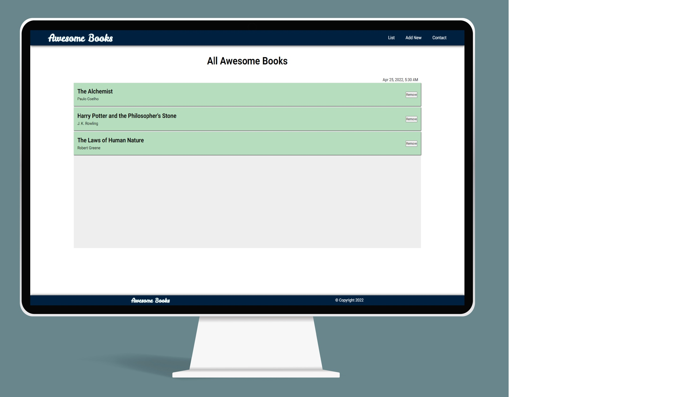

# Project - Awesome Books ES6

It uses SPA (Single-page application) for the following pages:
1. List
2. Add Book
3. Contact

## Built With

- HTML
- CSS
- javaScript

## Live Demo
[Live Demo Link](#)

To get a local copy up and running follow these simple example steps.
- Copy this [link](#)
- Open the terminal
- Run "git clone" and paste the link
- Open this folder in your code editor
- Create a feature branch to work on
- Now you can edit and make a pull request

## Authors

👤 **Author1**

- GitHub: [@jasonfelice](https://github.com/jasonfelice)
- LinkedIn: [LinkedIn](https://www.linkedin.com/in/jason-felice-11a5a622b/)

## 🤝 Contributing

Contributions, issues, and feature requests are welcome!

Feel free to check the [issues page](../../issues/).

## Acknowledgments

- Monitor screen vector created by [rawpixel.com - www.freepik.com](https://www.freepik.com/vectors/monitor-screen)

## 📝 License

This project is [MIT](./MIT.md) licensed.